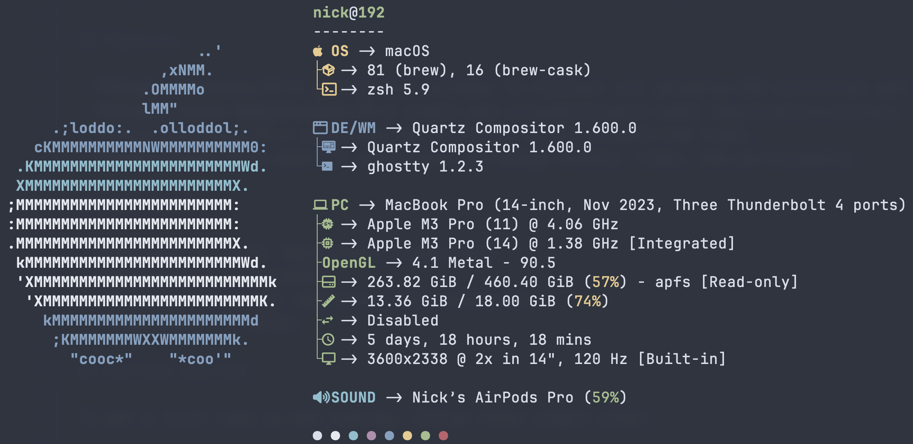

<div align="center">

```
 ███╗   ██╗██╗ ██████╗██╗  ██╗
 ████╗  ██║██║██╔════╝██║ ██╔╝
 ██╔██╗ ██║██║██║     █████╔╝
 ██║╚██╗██║██║██║     ██╔═██╗
 ██║ ╚████║██║╚██████╗██║  ██╗
 ╚═╝  ╚═══╝╚═╝ ╚═════╝╚═╝  ╚═╝
```

### `IB STUDENT // CS HL · MATH AA HL · BUSINESS SL`

*building things that are either genuinely useful or genuinely interesting — ideally both*


<p>
  <a href="https://github.com/Jurredr/github-widgetbox">
    
  </a>
</p>


</div>

---

## 👤 What is this

The person behind the repos. IBDP student in Athens — Computer Science HL,
Mathematics AA HL, Business SL — focused on AI, full-stack development, and
entrepreneurship. Every repo below shares one visual identity; this page is
the boot screen.

```console
guest@nick:~$ whoami
guest. but this profile belongs to nick trimandylis —
swift, python, typescript, and an unhealthy number of side quests.
```

## 🚢 The fleet

| | project | what it actually is | stack |
|---|---|---|---|
| 01 | [**portfolio**](https://github.com/nitrimandylis/portfolio) | my portfolio, disguised as an operating system you boot by scrolling | vanilla JS · GSAP · zero frameworks |
| 02 | [**pm-dashboard**](https://github.com/nitrimandylis/pm-dashboard) | mission control for the IB Diploma — two-way Notion sync, brutalist | vanilla ES modules · Bun |
| 03 | [**kizuna**](https://github.com/nitrimandylis/kizuna) | 絆 — community platform for IBDP students: CAS, clubs, events | Flask · PostgreSQL · Render |
| 04 | [**tokenpilot**](https://github.com/nitrimandylis/tokenpilot) | LLM spend auditor — reads Admin APIs, finds the money leaks | Next.js · TypeScript |
| 05 | [**LLM-Mafia**](https://github.com/nitrimandylis/LLM-Mafia) | Mafia, except every player is a local LLM with an alibi | Python · Ollama |
| 06 | [**Petal.AI**](https://github.com/nitrimandylis/Petal.AI) | AI tutor for iOS with a guilt-powered streak system | SwiftUI · Gemini |
| 07 | [**IB-News-site**](https://github.com/nitrimandylis/IB-News-site) | the school Gazette — full CMS with an editor's desk | Flask · PostgreSQL |
| 08 | [**J.A.R.V.I.S.**](https://github.com/nitrimandylis/J.A.R.V.I.S.) | AI butler harness for Notion + Google Workspace | Bun · TypeScript |

## 🧰 Tech stack

**Languages**

[](https://skillicons.dev)

**Frameworks & Tools**

[](https://skillicons.dev)

**AI / ML**

[](https://skillicons.dev)

## 🖥️ Battlestation

<table align="center">
  <tr>
    <td align="center">
      <table>
        <tr><td><b>Machine</b></td><td>MacBook Pro M3 Pro</td></tr>
        <tr><td><b>OS</b></td><td>macOS</td></tr>
        <tr><td><b>Terminal</b></td><td>Ghostty</td></tr>
        <tr><td><b>Editors</b></td><td>Zed · VS Code</td></tr>
        <tr><td><b>Browser</b></td><td>Helium</td></tr>
        <tr><td><b>Theme</b></td><td>Nord / Catppuccin</td></tr>
        <tr><td><b>AI Agent</b></td><td>Claude Code</td></tr>
        <tr><td><b>Package Manager</b></td><td>Homebrew</td></tr>
      </table>
    </td>
    <td align="center">
      
    </td>
  </tr>
</table>

---

<div align="center">

`ALWAYS LEARNING. ALWAYS SHIPPING. OCCASIONALLY SLEEPING.`

*"Dark mode should be mandatory. Fresh installs solve everything. Git is a mystery I refuse to solve."*

</div>
